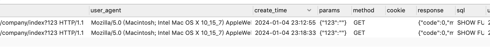

<h1 align="center">
    ThinkPHP  rlog
</h1>

<p align="center">
	<strong>think-rlog 是个新项目上手神器，对于入库新公司的项目或二开项目时，不了解业务数据逻辑。
可以使用它记录所有请求信息，响应信息，以及执行的sql语句。</strong>    
</p>





## 使用方法

1. 使用`composer`安装库：

```
composer require rbrr/think-rlog
```


2. 添加事件监听,在应用全局事件文件event.php中加入

```php

    'listen' => [
        'AppInit'     => ['tlog\listener\WriteRequestLog'],
        'HttpRun'     => [],
        'HttpEnd'     => ['tlog\listener\WriteResponseLog'],
    ]

```


如果没有建立日志表，可以手工执行命令

```
php think tlog:publish
```

这将自动生成 `log_request` 和 `log_curl` 表。

如果没有这个命令可以尝试手工注册下面的服务

在应用的全局公共文件service.php中加入：

```php
return [
    // ...

    tlog\tlogService::class,
];
```


#### 如果只想某些ip请求才记录日志，可以指定白名单ip

在应用的配置文件 app.php 中加入
[
    'rlog'=>[
        'white_list'=>'127.0.0.1','192.168.1.8' //指定需要记录请求信息的ip
    ]
] 
